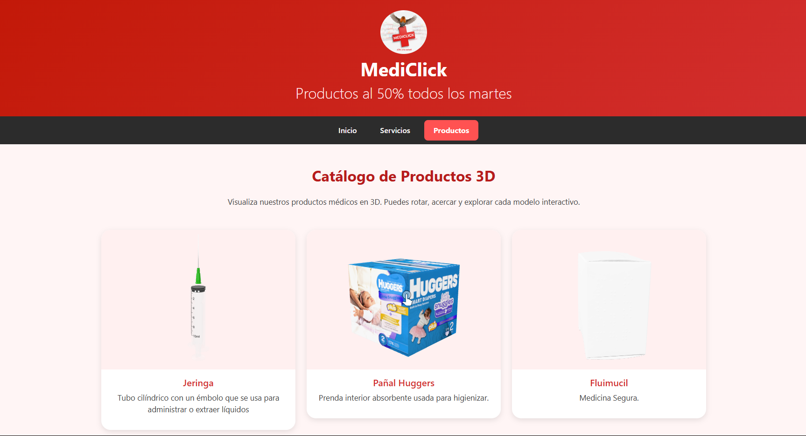

<h1 align="center">💊 MediClick — Plataforma Web de Farmacia (Tomcat 11 + JSP)</h1>

  <strong>Aplicación web de farmacia desarrollada en Java con JSP, Servlets, Tomcat 11 y PostgreSQL</strong> 
  Incluye modelos 3D (.glb), autenticación por roles y un diseño moderno tipo e-commerce.

<h2>🚀 Características principales</h2>

<ul>
  <li><strong>Gestión de productos farmacéuticos</strong></li>
  <li>Visualización interactiva de modelos <strong>3D GLB</strong></li>
  <li>Sistema de usuarios con roles:
    <ul>
      <li>Administrador</li>
      <li>Vendedor</li>
      <li>Cliente</li>
    </ul>
  </li>
  <li>Carrito de compras dinámico</li>
  <li>Conexión con base de datos <strong>PostgreSQL</strong></li>
  <li>Interfaz responsive con <strong>Bootstrap 5</strong></li>
  <li>Arquitectura <strong>MVC</strong> con Servlets + JSP</li>
</ul>

<h2>🧠 Objetivo del proyecto</h2>

Crear una plataforma moderna para farmacias, permitiendo gestionar productos, usuarios y ventas,
integrando además modelos 3D para mejorar la experiencia visual del usuario.

<h2>🛠 Tecnologías utilizadas</h2>

<table>
  <tr>
    <th>Tecnología</th>
    <th>Uso</th>
  </tr>
  <tr>
    <td>Java 17 / 21</td>
    <td>Lógica de negocio</td>
  </tr>
  <tr>
    <td>JSP / JSTL</td>
    <td>Generación dinámica de páginas</td>
  </tr>
  <tr>
    <td>Servlets</td>
    <td>Controladores MVC</td>
  </tr>
  <tr>
    <td>Tomcat 11</td>
    <td>Servidor Web</td>
  </tr>
  <tr>
    <td>PostgreSQL</td>
    <td>Base de datos</td>
  </tr>
  <tr>
    <td>Bootstrap 5</td>
    <td>Diseño e interfaz</td>
  </tr>
  <tr>
    <td>GLB / GLTF</td>
    <td>Modelos 3D</td>
  </tr>
</table>

<h2>📁 Estructura del proyecto</h2>

<pre>
MediClick_Tomcat11/
│
├── src/
│   ├── main/
│   │   ├── java/        ← Servlets, modelos, DAO
│   │   ├── webapp/      ← JSP, CSS, JS, imágenes
│   │   │   ├── css/
│   │   │   ├── js/
│   │   │   ├── img/
│   │   │   ├── modelos3d/
│   │   │   └── *.jsp
│   └── resources/
│
├── WEB-INF/
│   ├── web.xml
│
├── glb_models/
├── README.md
</pre>

<h2>⚙️ Instalación y ejecución</h2>

<h3>1️⃣ Clonar el repositorio</h3>
<pre>git clone https://github.com/tuusuario/MediClick_Tomcat11.git</pre>

<h3>2️⃣ Importar en tu IDE</h3>

Funciona en IntelliJ, Eclipse o VS Code (con extensiones de Java).

<h3>3️⃣ Configurar Tomcat 11</h3>

Añadir Tomcat 11 como servidor y desplegar el proyecto.

<h3>4️⃣ Configurar base de datos PostgreSQL</h3>

Importar tablas, triggers y datos iniciales.

<h3>5️⃣ Ejecutar la web</h3>
<pre>http://localhost:8080/FARM/</pre>

<h2>🖼 Capturas del proyecto</h2>

  

  

<h2>👤 Autores</h2>
<ul>
  <li><strong>Emily Mabel Ortega Constante</strong></li>  
</ul>

<h2>📜 Licencia</h2>

Este proyecto es de uso académico y demostrativo.

